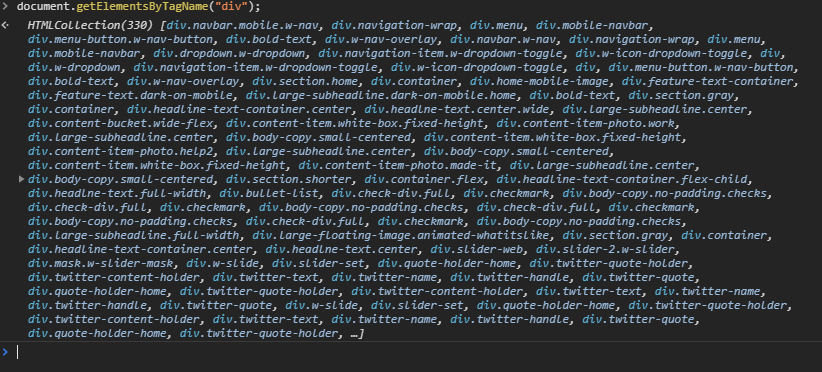
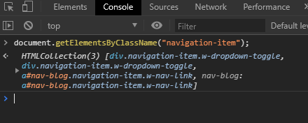
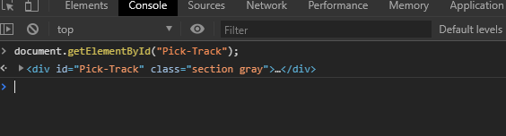
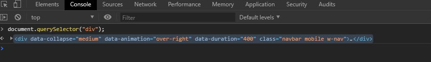
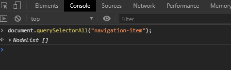

## Introduction to the DOM

### 1. Explain what the DOM is and how it relates to an HTML page

#### A. Document Object Model
  1. It is an object representation of the HTML elements of a webpage. It is *NOT* the HTML page itself. 
  2. The DOM is an Application Programming Interface (API). 
     <ul><li> It's kind of a bridge between one thing and another thing.</li>
     <li> In our case, the DOM is a bridge between Content and the browser (Content -- DOM --> Browser)</li></ul>
#### B. What the DOM is *NOT*:
  1. JavaScript - JS is just tightly intertwined because of the syntax we see
  2. HTML or CSS
  3. Static - "Static" doesn't change or do anything
#### C. What the DOM *IS*:
  1. Language-Neutral API - This means JavaScript is not the *only* language that can actually manipulate it
  2. Tree-like structure *representing* your content, structure, and style
  3. Dynamic - meaning, if we change it live, it changes right before our eyes. 
#### D. Document (Node Element)
<ul></ul>

#### E. How to Code in the DOM!
  1. Go to [LambdaSchool.com](https://lambdaschool.com/) and get into browser developer tools
  2. "Elements" show you how the page is built out
    <ul><li> Go to the h1 tag </li>
    <li> Type "This is the DOM!"</li>
    <li> Click off or away from the h1 tag </li>
    <li> It updates with the new text </li>
    <li> This is *not* permanent! It's only visible on your own browser. This is great for experimenting! </li></ul>
  3. Go to "Console"
    <ul><li> Type in `console.log(document)` </li>
    <li> Click on the arrow next to `#document` </li>
    <li> You'll see all the Elements of the Dom tree </li></ul>

### 2. DOM Selectors

#### A. In order to access the DOM in "console," we use the object called `document` as our base.
#### B. `document` is going to be our entire DOM. There are lots of different methods and propertes. We will review 5 major methods and properties below.
#### C. Classic DOM Selectors
  1. `document.getElementsByTagName();` 
    <ul><li>By making "Element" plural, you get all the requested tags</li>
    <li>TagName refers to the actual tag element itself. For example, you could target `nav`, `header`, `img`, `a`, etc.</li>
    <li>The console returns an HTMLCollection.
      <ul><li>HTMLCollection is an array-like object</li>
      <li>Looks exactly like an array</li>
      <li>Acts almost like an array except for a few minor details
      </li></ul></ul>
  2. `document.getElementsByClassName();`
    <ul><li>Takes a string with the name of the class we want to select</li>
    <li>No need to use a dot inside the parentheses</li>
    <li>This also returns an HTMLCollection</li>
    </ul>
  3. `document.getElementById();` This version only has 1 element because it is targeting an ID
    <ul><li>Remember, element cannot be plural here due to the CSS rules on ID</li>
    <li>No HTMLCollection is returned</li>
    <li>We only get that one, single element
    </li></ul>
#### D. Modern DOM Selectors
JQuery, a JavaScript library, came out and helped us with selectors and lots of other things. JQuery kind of popularized this idea that we can select items on a page based on a CSS style-selector. Instead of using any of the previous Classic DOM selectors, the JavaScript "powers that be" decided to include JQuery's style-selector in vanilla JavaScript.
  1. `document.querySelector();` 
    <ul><li> .querySelector will take one string from:
       <ul><li> an element name,</li>
       <li> an ID,</li>
       <li> a class,</li>
       <li> Anything that we can select via CSS (including the wildcard selector - * )</li></ul>
    <li> Returns that single element. Even if there are multiple ones available, as is usually the case with a class, it will only return the very first item it finds that matches that query.
    </li></ul>
  2. `document.querySelectorAll();`
    <ul><li>If you want to get all the items of a particular element, like a div or class, you want this method.</li>
    <li>Returns a node list back</li>
    <li> Can use the forEach method.</li>
    <li> HOWEVER, querySelectorAll cannot use the reduce() or map() methods</li>
    <li> Almost identical to an HTMLCollection</li>
    <li> Click on arrow next to NodeList to explore more</li>
    </ul>

#### E. Difference between HTMLCollection and NodeList

1. Similarities
    <ul><li>Both look like arrays</li>
    <li>Zero-based Index</li>
    <li>List of Items</li>
    <li>Both have length property</li>
    <li>Shallow Copied</li></ul>
2. Differences
    <ul><li>NodeLists can use the forEach() method, but HTMLCollection does NOT have that function.</li>
    <li>NodeLists provide more built-in methods</li>
    <li>HTMLCollection is faster in performance because there are NO built-in methods</li></ul>
3. If you want to use `map()`, `filter()`, `sort()`, etc, you can use the prototype from array. `Array.from()` takes a single argument from an array-like object and gives us back an actual array. Example:

```
const arr = Array.from(nodeList); // Turns into an array 
                      // Can use HTMLCollection here too
                      
arr.map(item => { return item}); // Returns an array
```

### 3. DOM Properties and Methods
This section shows how to do things to elements once e select them by using DOM properties and methods.

Create a new element and select the element
```
// SETUP Code
const introText = document.querySelector(#intro-info p"); // #intro-info is PARENT and p is CHILD

introText; // Returns paragraph tag
```

#### A. .textContent
Returns whatever the content is inside the selected element. 

1. Working off the setup code above, the following will provide the actual paragraph, not the tags.
``` 
introText.textContent
```

2. You can also set the text content this way:
```
introText.textContent = "Here's some new text content.";
```

  When you press enter in the DOM, the live view of the paragraph is replaced with the new paragraph text. In this case, the site page shows "Here's some new text content."

#### B. .setAttribute
1. .setAttribute is a method that we can use to change an element. For example, you can change the page's image.

```
// Setup
const catImg = document.querySelector("img");
catImg  // Prints catImg information
```
2. It takes 2 arguments
    <ul><li> First argument is a string with an attribute name in it, like "src".</li>
    <li> Second argument is a string of what you want to set that attribute to. In this case, we will use a different source link for the catImg.</li></ul>

```
catImg.setAttribute('src', "https://exampleimg.com") 
// When you press Enter, the image will update to this new image
```

3. Important to Remember
    <ul><li>When changing things on the DOM, it is NOT changing the HTML.</li>
    <li>Instead, this is changing the JavaScript representation of the HTML on the page (where it's being displayed).</li></ul>

4. An alternative to the setAttribute method is the Property way. You just give the name of the attribute itself as a property.

```
catImg.src = "https://anotherCatImage.com"
```

#### C. .style
1. .style is a property
2. It is an object with literally every single CSS property that is available in the DOM, such as cursor, display, fontSize, etc.
3. In CSS, we write out properties like "font-size" or "background-color". However, in JavaScript, we use camel casing instead. 
    <ul><li>To target CSS' `font-size`, we would use `fontSize` in JavaScript. </li>
    <li>You can't use the CSS hyphen because JS translates it as a minus sign, making it perform a math operation.</li></ul>
4. 


## Deeper Dive Resources

 * [DOM page](https://developer.mozilla.org/en-US/docs/Web/API/Document_Object_Model) - Mozilla Developers Network (MDN) Resource
 * [HTMLCollection Page](https://developer.mozilla.org/en-US/docs/Web/API/HTMLCollection) - Another MDN Resource
 * [NodeList](https://developer.mozilla.org/en-US/docs/Web/API/NodeList) - MDN


## DOM-I Lecture Notes

### Single Element DOM Selectors

1. The Node - Everything in DOM Tree is a node. 
2. Window --> document but you don't have to write `window.document.blahBlahBlah()`.
3. Methods:
* `.getElementById()`
```
// HTML File:
<button id="custom-btn" class="lambda-button"><span>Work</span> with us!</button>

// JavaScript File:

const btnId = document.getElementById("custom-button"); // No # needed here because of method name
console.log(btnId); // Prints HTML info into console
```

* `.querySelector()` - Finds the FIRST matching selector and is done after that

```
const btnQuery = document.querySelector("#custom-btn"); 
// NOTE: ^^^ Can use ".lambda-button" to get button by class instead of ID
console.log(btnQuery);
```


### Multiple Element DOM Selectors

The dunderproto ( `__proto__` ) will show types of methods available. However, it is SUPER limited.

* [document.getElementsByTagName()](https://developer.mozilla.org/en-US/docs/Web/API/Document/getElementsByTagName)

 ```
 const pTags = document.getElementsByTagName("p"); // Notice 'Elements' is PLURAL
 console.log(pTags) // Lists ALL p tags, kind of like an array
 console.log(pTags[0]); // will print 1st Indexed p tag
 ```

 * [Array.from()](https://developer.mozilla.org/en-US/docs/Web/JavaScript/Reference/Global_Objects/Array/from#Description)

 ```
 // Example 1
 const pTagsArray = array.from(pTags);
 console.log(pTagsArray); // Prints an array of all p tags
```

```
// Example 2
const contentAreaQArr = Array.from(contentAreaQ);
console.log(contentAreaQArr);
 ```

* [document.querySelectorAll](https://developer.mozilla.org/en-US/docs/Web/API/Document/querySelectorAll) - NodeList
Returns a NodeList. It's basically identical to HTMLCollection BUT gains a couple new methods like forEach(), entries, etc.

```
const contentAreaQ = document.querySelectorAll(".content-area");
console.log(contentAreaQ); // Returns a NodeList

contentAreaQ.forEach(item => ({
    console.log(item);
}));
```

#### Dom Manipulation 

With the DOM, you can make templates.

Manipulating the DOM will still show the updates even if the elements are removed in HTML. For example, if you remove an image source in HTML (like all `scr="www.thislink.com"`), it still works because of DOM manipulation.

##### `.textContent`
1. The textContent property sets or returns the text content of the specified node, and all its descendants.
2. If you set the textContent property, any child nodes are removed and replaced by a single Text node containing the specified string.

```
const servicesHeader = document.querySelector(".services-header");
console.log(servicesHeader);

servicesHeader.textContent = "New Services";
console.log(servicesHeader);
```

3. JavaScript DOM adds inline-styling which is the *highest* specificity. 
   * JavaScript Style Can't Use: `style.background-color`.
   * JavaScript Style CAN use: `style.backgroundColor`.

```
const secondaryHeaders = document.querySelectorAll("h2");
console.log(secondaryHeaders);

// You can change colors by Hard Coding but is Not Recommended. It is not using the DRY principle. 
secondaryHeaders[0].style.color = "crimson";
secondaryHeaders[1].style.color = "crimson"; // NOT DRY

// Do this instead:
secondaryHeaders.forEach(function(currentValue) {  // This replaces the hard coded version on ALL h2's
    currentValue.style.color = "crimson";
});

// Arrow Function Version - May be less easy to read for the next developer behind you
secondaryHeaders.forEach(currentValue => currentValue.style.color = "crimson");


```


##### `.setAttribute()`
1. The setAttribute() method adds the specified attribute to an element, and gives it the specified value.
2. If the specified attribute already exists, only the value is set/changed.
3. Although it is possible to add the style attribute with a value to an element with this method, it is recommended that you use properties of the Style object instead for inline styling, because this will not overwrite other CSS properties that may be specified in the style attribute.

```
const servicesImg = document.querySelector(".services-img");
console.log(servicesImg);

servicesImg.setAttribute("src", "https://www.blahblahimages.com");
servicesImg.setAttribute("alt", "Laptop sitting on desk with coffee");
console.log(servicesImg);
```

* Alternative Option:

```
servicesImg.src("https://www.blahblahimages.com"); // Super Easy to Read
servicesImg.alt("Laptop sitting on desk with coffee"); // Adds alt text for Screen Readers

console.log(servicesImg);
```

```
const secondaryHeaders = document.querySelectorAll("h2");
console.log(secondaryHeaders);
console.log(secondaryHeaders[0;]);
secondaryHeaders[0].style.color = "blue";
```

* If you had lots to change to `secondaryHeaders`, you could do the following: 

```
secondaryHeaders.forEach(header => {
    header.style.color = "blue";
});

header.style.fontSize = "3rem";
header.style.backgroundColor = "yellow";

// IMPORTANT - Since it's an array for CSS, and not HTML elements, you can't do the following:

secondaryHeaders.style.color = "red";
```

##### `.classList` AKA a DOMTokenList
1. The classList property returns the class name(s) of an element, as a DOMTokenList object.
2. This property is useful to `.add()`, `.remove()`, and `.toggle()` CSS classes on an element.
3. The classList property is read-only, however, you can modify it by using the add() and remove() methods.

```
const bottomDiv = document.querySelector(".bottom-div");
console.log(bottomDiv);

console.log(bottomDiv.classList); // Gives actual list of all classes in this div. Array-like.

bottomDiv.classList.remove("extra-stuff"); // Removes "extra-stuff" CSS rules
bottomDiv.classList.add("lambda-button");
console.log(bottomDiv.classList);
```


#### Creating New DOM Elements from JavaScript

1. Create something

```
const newPTag = document.createElement("p");
console.log(newPTag); // Prints empty <p> tag
```
2. Add Content

```
newPTag.textContent = "Hello, World!";
console.log(newPTag); // Prints <p>Hello, World!<p>
```
3. Add it to the DOM
```
const extraStuff = document.querySelector(".extra-stuff");
console.log(extraStuff);

extraStuff.append(newPTag); // The append method puts on end
extraStuff.prepend(newPtag); // The prepend method put on beginning
```

```
const technologies = ["UX", "JS", "HTML/CSS"];
const workList = document.querySelector(".work-list");
console.log(workList);

technologies.forEach(currentValue => {
    // Const wouldn't work OUTSIDE the Curly Brackets without the LET variable instead
    const listItem = document.createElement("li"); 
    listItem.textContent = tech;
    workList.append(listItem);
});
```